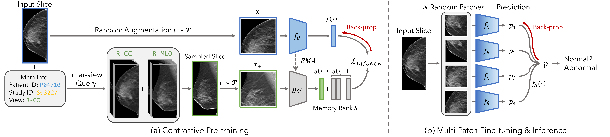

# SIFT-DBT: Self-supervised Initialization and Fine-Tuning for Imbalanced Digital Breast Tomosynthesis Image Classification



<h4>
Yuexi Du, Regina J Hooley, John Lewin, Nicha C. Dvornek
</br>
<span style="font-size: 14pt; color: #555555">
Yale University
</span>
</h4>

This is the official implementation for IEEE-ISBI 2024 paper "SIFT-DBT: Self-supervised Initialization and Fine-Tuning for Imbalanced Digital Breast Tomosynthesis Image Classification" [[Paper](https://arxiv.org/pdf/2403.13148.pdf)]


## Environment Set-up

We provide the exact environment configuration in `environment.yml`. One may reproduce it with following command:
```bash
conda env create -f environment.yml
conda activate sift-dbt
```

## Data

We uses BCS-DBT dataset for our experiment. To access the data, you may directly run `python download_data.py`, which will download the data and unzip it to `./data/Breast-Cancer-Screening-DBT` folder. Note that the full data may take up to 2TiB space. You may need to pre-process the data to desired size to save space. Also, please use OTSU cut to crop the original DBT to avoid sample background during training.

To pre-process the data and create a training/validation/testing split, you may run `python build_dbt_cls.py`. This will down-sample the original DBT images and crop them with OTSU cut, then save each slice into a individual `.png` file.

## Pre-trained Model

Coming soon...

## Reproduce our method

### Pre-training
To pre-train the model, run the following command for the desired model:
```bash
# ResNet-50
python main_pretrain.py -b 32 --epochs 4000 --lr 0.015 --sgd --cos --model-type resnet50 --cudnn --use-otsu --num-slice 1 --ddp --world-size 4 --save-model --log --log-interval 100 --contrastive --cj-strength 0.2 --inter-slice --inter-view --target-H 448 --target-W 448
# Simple CNN
python main_pretrain.py -b 32 --epochs 4000 --lr 0.015 --sgd --cos --model-type simple --cudnn --use-otsu --num-slice 1 --ddp --world-size 4 --save-model --log --log-interval 100 --contrastive --cj-strength 0.2 --inter-slice --inter-view --target-H 448 --target-W 448
```

### Disc. Fine-tuning
To fine-tune the pre-trained model as described in the paper, run the following commands:
```bash
# ResNet-50
python main_cls.py -b 32 --epochs 50 --lr 1e-2 --sgd --cos --binary --model-type resnet50 --num-slice 1 --target-H 448 --target-W 448 --subset --subset-ratio 5.0 --ignore-action --patch-lv --patch-size 448 --balance-data --binary-balance --test-batch-size 32 --log-interval 1000 --log --moco-aug --affine-prob 0.2 --cudnn --ddp --world-size 4 --load-model <pretrained_model_dir> --load-moco --save-model --save-best --disc-transfer
# Simple CNN
python main_cls.py -b 32 --epochs 50 --lr 1e-2 --sgd --cos --binary --model-type simple --num-slice 1 --target-H 448 --target-W 448 --subset --subset-ratio 5.0 --ignore-action --patch-lv --patch-size 448 --balance-data --binary-balance --test-batch-size 32 --log-interval 1000 --log --moco-aug --affine-prob 0.2 --cudnn --ddp --world-size 4 --load-model <pretrained_model_dir> --load-moco --save-model --save-best --disc-transfer
```

Replace `<pretrained_model_dir>` with the relative path to the pre-trained model. Note that here we only uses a subset of full training set for fine-tuning.

## Evaluation
### Slice-level Evaluation with multiple patches
To reproduce the slice-level evaluation metrics, run the following commands:
```bash
# ResNet-50
python test.py --model-type resnet50 --target-H 448 --target-W 448 --ignore-action --test-batch-size 128 --log-interval 200 --load-model <finetuned_model_dir> --cudnn --binary --load-best --patch-lv --patch-size 448 --patch-cnt <patch_cnt>
# Simple CNN
python test.py --model-type simple --target-H 448 --target-W 448 --ignore-action --test-batch-size 128 --log-interval 200 --load-model <finetuned_model_dir> --cudnn --binary --load-best --patch-lv --patch-size 448 --patch-cnt <patch_cnt>
```

Replace `<patch_cnt>` with different number of patches to evaluate the prediction performance on the test set.


### Volume-level Evaluation

First, we extract the features with maximum number of patches $n=20$. 
```bash
# ResNet-50
python test.py --model-type resnet50 --target-H 448 --target-W 448 --test-batch-size 32 --ignore-action --log-interval 200 --load-model <finetuned_model_dir> --cudnn --binary --load-best --patch-lv --patch-size 448 --patch-cnt 20 --extract-feat
# Simple CNN
python test.py --model-type simple --target-H 448 --target-W 448 --test-batch-size 32 --ignore-action --log-interval 200 --load-model <finetuned_model_dir> --cudnn --binary --load-best --patch-lv --patch-size 448 --patch-cnt 20 --extract-feat
```
The extracted features will be placed under `<finetuned_model_dir>` as a `.npz` file. We then uses `volume_eval.py` to evaluate the volume level performance: `python volume_eval.py`. Remember to replace `feat_path` with extracted features.

## Citation
```bibtex
@article{du2024sift,
  title={SIFT-DBT: Self-supervised Initialization and Fine-Tuning for Imbalanced Digital Breast Tomosynthesis Image Classification},
  author={Du, Yuexi and Hooley, Regina J and Lewin, John and Dvornek, Nicha C},
  journal={arXiv preprint arXiv:2403.13148},
  year={2024}
}
```


## Acknowledgement

This work was supported by NIH grant R21EB032950. We also thank Jiazhen Zhang for the helpful discussions.